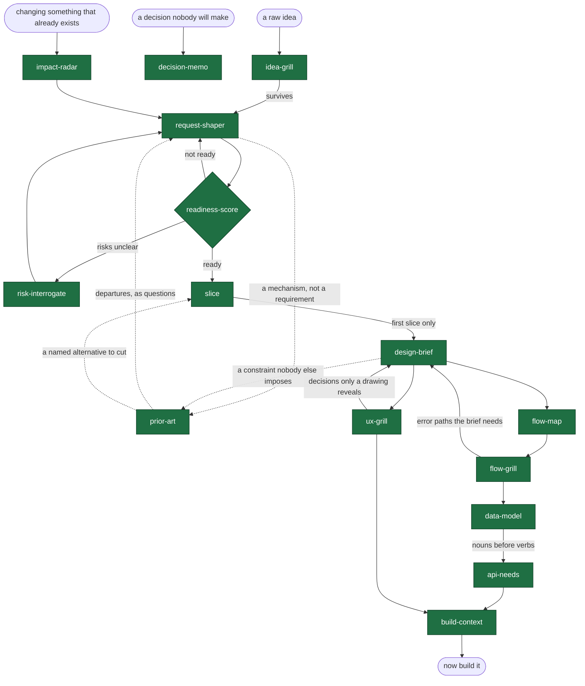

# before-you-build

**Building is cheap now. Deciding what to build is still the bottleneck.**

A set of Claude Code skills for the work that happens before a single line of code: challenge the idea, shape the request, measure whether it is actually ready, and extract the decisions that make the difference between a thing that looks right and one that *is* right.

It serves two builders. One writes a request and hands it to a team. The other hands it to a model that will write the whole product. **The second needs this more, not less** — a team asks when something is missing, and a generator fills the gap silently and confidently, in a way that reads as finished.

These skills are deliberately hard to please. A model asked to review something will usually find a way to approve it — that is the failure this repo is built against.

## Install

```bash
/plugin marketplace add ratipcan-uysal/before-you-build
/plugin install before-you-build
```

Then just describe what you have. The skills trigger on their own, or run `/byb` to be routed.

## Where to start

There is no single front door. What you reach for depends on what landed on your desk.

| What arrived | Can you argue with it? | Start here |
|---|---|---|
| An idea nobody has committed to — yours | yes | `idea-grill` |
| A request from a business unit or a client | on their behalf | `idea-grill` in proxy mode — the output is the questions to take back to them |
| A half-formed request that needs writing up | — | `request-shaper` |
| A document from another team, and the question is "is this enough?" | — | `readiness-score` |
| A decision made above you, with detail | no | [`risk-interrogate`](skills/risk-interrogate/SKILL.md) — nothing needs shaping because nothing can be changed; the failure modes are your whole contribution |
| A decision made above you, with no detail | no | [`request-shaper`](skills/request-shaper/SKILL.md) first — risk questions need decisions to attach to, and there are none yet |
| A change to something that already exists | no | [`impact-radar`](skills/impact-radar/SKILL.md) |
| A request that specifies *how*, and nobody has asked why that way | — | [`prior-art`](skills/prior-art/SKILL.md) — it reads what already solves this and hands back questions |
| A product you are building yourself, with a model writing the code | yes | `idea-grill`, then the chain — everything you leave out gets invented, and you will not be told |

Most of the work inside an organisation is the rows where the answer is *no*. The set is built for those too, not only for the founder defending their own idea.

## The chain



Nothing forces you to run the whole chain. Most sessions use one skill.

**The design part is a loop, not a line.** Some decisions cannot be made until something has been drawn — *"two recipients have the same name; how does anyone tell them apart"* is not derivable from a request, and nobody thinks of it until two identical cards sit side by side. The brief decides what can be decided, the drawing surfaces the rest, the grill names them, and they go back to the brief. Expect two or three passes, and expect the second one to be the useful one.

## Skills

| Skill | Answers | |
|---|---|---|
| [`idea-grill`](skills/idea-grill/SKILL.md) | Should we build this at all? | ✅ |
| [`request-shaper`](skills/request-shaper/SKILL.md) | What exactly are we building? | ✅ |
| [`readiness-score`](skills/readiness-score/SKILL.md) | Is it ready to build? (0–100 + verdict) | ✅ |
| [`slice`](skills/slice/SKILL.md) | What ships first, and what falls out? | ✅ |
| [`design-brief`](skills/design-brief/SKILL.md) | What should the screens actually do? | ✅ |
| [`ux-grill`](skills/ux-grill/SKILL.md) | Is this design right? | ✅ |
| [`risk-interrogate`](skills/risk-interrogate/SKILL.md) | What breaks in production? | ✅ |
| [`flow-map`](skills/flow-map/SKILL.md) | What happens, in what order, including the unhappy paths? | ✅ |
| [`flow-grill`](skills/flow-grill/SKILL.md) | Is the flow logically complete? | ✅ |
| [`data-model`](skills/data-model/SKILL.md) | What must the system remember? | ✅ |
| [`api-needs`](skills/api-needs/SKILL.md) | What must the system be able to provide? | ✅ |
| [`prior-art`](skills/prior-art/SKILL.md) | How is this already solved, and where do we depart? | ✅ |
| [`impact-radar`](skills/impact-radar/SKILL.md) | If I change this, what do I break? | ✅ |
| [`decision-memo`](skills/decision-memo/SKILL.md) | How do I get a decision made? | ✅ |
| [`build-context`](skills/build-context/SKILL.md) | What does whoever writes the code need, and what must they not invent? | ✅ |

**Producing** and **grilling** are always separate skills. A model that generates a design and then reviews it will approve its own work — not from vanity, but from the ordinary pull of consistency. `design-brief` decides; `ux-grill` attacks. They never run in the same breath.

## See it working

[A full `idea-grill` session](examples/idea-grill-session.md) — a fictional team wants to add an AI support chatbot. Four questions later it turns out they have a screen problem, not a chatbot problem, and they had never looked at their own ticket data.

Then [one fictional request carried through twelve skills](examples/README.md), in the order they were actually run — a bank asks for one-tap repeat transfers, and thirteen documents later it has a flow with nine error paths, a design record on its second version, seven unconfirmed system needs, and a first slice that leaves out the part the feature is named after.

And [a second request, a different shape](examples/seller-score/README.md) — a marketplace wants to change what a seller's score means, and twenty documents later the release being proposed does not change the score at all. It starts where most work inside an organisation starts, with something that already exists, so it enters at `impact-radar` rather than `idea-grill`.

They are deliberately unflattering. The score comes back NOT READY twice. The design violates its own brief and nothing looks wrong. Two of the reviews open by declaring themselves compromised, because the same session produced what they are reviewing.

## The method

Ten principles the skills are built on — steelman before you strike, one question at a time, silence is never consent, named verdicts instead of vibes. [`docs/method.md`](docs/method.md). The calls made along the way, with what was rejected and why, are in [`docs/decisions.md`](docs/decisions.md).

The one worth stealing even if you never install this: **if the document does not say it, it scores zero.** Something counts as out of scope only when the document positively says so, quoted. Absence is never coverage.

## Status

`v4.3` — **fifteen skills**, none planned. The three added at 3.1 to 3.3 all come from one correction: the set was built for a PM handing a request to a team, and it also has to serve someone handing it to a model that writes the whole product. `data-model` because an undefined schema gets invented, `slice` because the chain was being run across scope that would not ship, and `build-context` because the chain ended in nine documents and nobody builds from nine documents. `state-matrix` was removed at v3.0 after three rounds of narrowing left it doing what `ux-grill` and `design-brief` already covered; [why](docs/decisions.md). From here the set changes because it is used. This repo has been public from the first commit, so you can read how it was built — including the passes where one skill caught another, and the two occasions a skill caught its own author.

What changed between versions — and which changes mean the same document now scores differently — is in [`CHANGELOG.md`](CHANGELOG.md).

Each skill ships with its trigger and boundary tests in [`evals/triggers.yaml`](evals/triggers.yaml), checked in CI. Boundary tests matter more than trigger tests: fifteen skills with overlapping descriptions fail by firing the wrong one, and the user never finds out why the answer was off.

## Origin

Built by **Ratip Can Uysal**.

Distilled from a private toolkit developed over years of enterprise product analysis — the kind of work where a request that looks finished turns out, three weeks into development, not to have been. This is the methodology rewritten from scratch, in the open, with none of the corporate specifics that made the original unpublishable. What survived the move is the part that was never company-specific anyway: how to refuse to fill a gap, and how to tell someone their idea did not hold.

Issues and skill proposals welcome.

## License

MIT — see [LICENSE](LICENSE).
