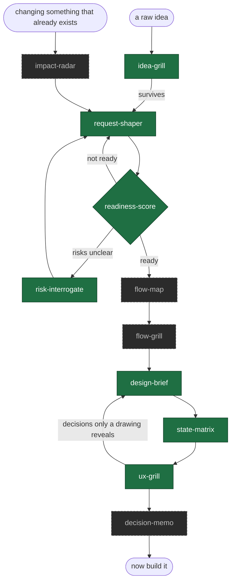

# before-you-build

**Building is cheap now. Deciding what to build is still the bottleneck.**

A set of Claude Code skills for the work that happens before a single line of code: challenge the idea, shape the request, measure whether it is actually ready, and extract the design decisions that make the difference between a screen that looks right and one that *is* right.

These skills are deliberately hard to please. A model asked to review something will usually find a way to approve it — that is the failure this repo is built against.

## Install

```bash
/plugin marketplace add ratipcan-uysal/before-you-build
/plugin install before-you-build
```

Then just describe what you have. The skills trigger on their own, or run `/byb` to be routed.

## Where to start

There is no single front door. What you reach for depends on what landed on your desk.

| What arrived | Can you argue with it? | Start here |
|---|---|---|
| An idea nobody has committed to — yours | yes | `idea-grill` |
| A request from a business unit or a client | on their behalf | `idea-grill` in proxy mode — the output is the questions to take back to them |
| A half-formed request that needs writing up | — | `request-shaper` |
| A document from another team, and the question is "is this enough?" | — | `readiness-score` |
| A decision made above you, with detail | no | [`risk-interrogate`](skills/risk-interrogate/SKILL.md) — nothing needs shaping because nothing can be changed; the failure modes are your whole contribution |
| A decision made above you, with no detail | no | [`request-shaper`](skills/request-shaper/SKILL.md) first — risk questions need decisions to attach to, and there are none yet |
| A change to something that already exists | no | `impact-radar` |

Most of the work inside an organisation is the rows where the answer is *no*. The set is built for those too, not only for the founder defending their own idea.

## The chain



Nothing forces you to run the whole chain. Most sessions use one skill.

**The design part is a loop, not a line.** Some decisions cannot be made until something has been drawn — *"two recipients have the same name; how does anyone tell them apart"* is not derivable from a request, and nobody thinks of it until two identical cards sit side by side. The brief decides what can be decided, the drawing surfaces the rest, the grill names them, and they go back to the brief. Expect two or three passes, and expect the second one to be the useful one.

## Skills

| Skill | Answers | |
|---|---|---|
| [`idea-grill`](skills/idea-grill/SKILL.md) | Should we build this at all? | ✅ |
| [`request-shaper`](skills/request-shaper/SKILL.md) | What exactly are we building? | ✅ |
| [`readiness-score`](skills/readiness-score/SKILL.md) | Is it ready to build? (0–100 + verdict) | ✅ |
| [`design-brief`](skills/design-brief/SKILL.md) | What should the screens actually do? | ✅ |
| [`ux-grill`](skills/ux-grill/SKILL.md) | Is this design right? | ✅ |
| [`risk-interrogate`](skills/risk-interrogate/SKILL.md) | What breaks in production? | ✅ |
| `flow-map` | What happens, in what order, including the unhappy paths? | planned |
| `flow-grill` | Is the flow logically complete? | planned |
| [`state-matrix`](skills/state-matrix/SKILL.md) | Which states did we forget? | ✅ |
| `impact-radar` | If I change this, what do I break? | planned |
| `decision-memo` | How do I get a decision made? | planned |

**Producing** and **grilling** are always separate skills. A model that generates a design and then reviews it will approve its own work — not from vanity, but from the ordinary pull of consistency. `design-brief` decides; `ux-grill` attacks. They never run in the same breath.

## See it working

[A full `idea-grill` session](examples/idea-grill-session.md) — a fictional team wants to add an AI support chatbot. Four questions later it turns out they have a screen problem, not a chatbot problem, and they had never looked at their own ticket data.

Then one request carried through three skills, so you can see what each adds:

1. [The input](examples/quick-send-request.md) — a bank's business unit asks for a one-tap repeat transfer. One page, one contradiction, and a lot of silence.
2. [`request-shaper`](examples/request-shaper-interview.md) — fifteen questions later it is a seven-section document. An answer doubles the scope mid-interview; two answers contradict each other ten minutes apart.
3. [`readiness-score`](examples/readiness-score-comparison.md) — 12/100 before, 39/100 after, and **NOT READY** both times. The score catches the shaper for stopping early and saying nothing about it.
4. [`risk-interrogate`](examples/risk-interrogate-pass.md) — six of sixteen draft questions struck for repeating gaps the document already listed. What survives is traceable to decisions that were made.

## The method

Eight principles the skills are built on — steelman before you strike, one question at a time, silence is never consent, named verdicts instead of vibes. [`docs/method.md`](docs/method.md). The calls made along the way, with what was rejected and why, are in [`docs/decisions.md`](docs/decisions.md).

The one worth stealing even if you never install this: **if the document does not say it, it scores zero.** Something counts as out of scope only when the document positively says so, quoted. Absence is never coverage.

## Status

`v1.1` — wave one is complete and `state-matrix` has joined it, closing the design loop: decide with `design-brief`, sweep the states, then attack it with `ux-grill` and take what you find back to the brief. Still to come: `flow-map`, `flow-grill`, `impact-radar`, `decision-memo`. This repo has been public from the first commit, so you can read how it was built — including the passes where one skill caught another.

What changed between versions — and which changes mean the same document now scores differently — is in [`CHANGELOG.md`](CHANGELOG.md).

Each skill ships with its trigger and boundary tests in [`evals/triggers.yaml`](evals/triggers.yaml), checked in CI. Boundary tests matter more than trigger tests: eleven skills with overlapping descriptions fail by firing the wrong one, and the user never finds out why the answer was off.

## Origin

Built by **Ratip Can Uysal**.

Distilled from a private toolkit developed over years of enterprise product analysis — the kind of work where a request that looks finished turns out, three weeks into development, not to have been. This is the methodology rewritten from scratch, in the open, with none of the corporate specifics that made the original unpublishable. What survived the move is the part that was never company-specific anyway: how to refuse to fill a gap, and how to tell someone their idea did not hold.

Issues and skill proposals welcome.

## License

MIT — see [LICENSE](LICENSE).
