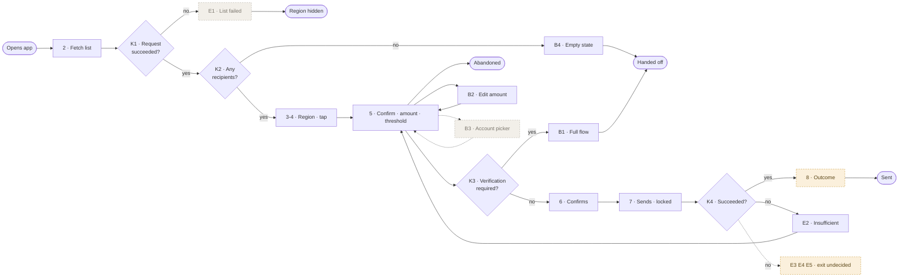

# Worked example — `flow-map`

Input: [the shaped Quick Send request](request-shaper-interview.md) and the [design decision record](design-brief-record.md). Not the record alone — screens tell you about reads; flows tell you about writes, sequencing and failure, and a flow derived from screens comes out read-shaped.

This is the second version. What the [flow grill](flow-grill-findings.md) found is at the bottom.

---

**Starts:** the customer opens the app, having sent money to at least one person before
**Ends:** money sent · abandoned · handed to the full transfer flow · region hidden
**Surface:** mobile. **On web one thing differs** — decision K3 always answers yes, so there is no passwordless path. Every other step is identical.
**Actors:** customer · the app · the transfer service · the receiving bank · remote configuration · analytics

## Happy path

| # | Actor | What happens | System |
|---|---|---|---|
| 1 | Customer | Opens the app | |
| 2 | System | Fetches the recipient list | **reads** |
| 3 | System | Shows the region — up to ten people, horizontally scrollable | **emits** |
| 4 | Customer | Taps a recipient | **emits** |
| 5 | System | Opens the confirmation; reads the last amount **and the current threshold** | **reads** |
| 6 | Customer | Confirms | **emits** |
| 7 | System | Sends the money; the surface locks and the exit control is removed | **acts** |
| 8 | System | Shows the outcome | **emits** · `[DECISION NEEDED]` |

## Decisions

**K1 — did the list request succeed?** *(from 2)* · timeout and error classes defined in `api-needs`
→ yes: **K2** · no: **E1**

**K2 — are there any recipients?** *(from K1)*
→ yes: **3** · no: **B4**

**K3 — is verification required?** *(from 5)* · yes when the amount is at or above the threshold **or** the surface is web
→ no: **6** · yes: **B1**

**K4 — did the send succeed?** *(from 7)*
→ yes: **8** · no: **E2 · E3 · E4 · E5**

## Branches

**B1 — verification required** → the system hands the recipient and amount to the full transfer flow · **acts** → **terminates: handed off**
*Double tap: the handoff opens once; a second tap is ignored.*

**B2 — the customer edits the amount** *(from 5)* → edits in place → **rejoins at 5**, where K3 is re-evaluated

**B3 — the customer changes the source account** *(from 5)* → the account picker opens · **reads** → **rejoins at 5**

**B4 — no recipients** *(from K2)* → empty state and shortcut → the customer taps *Send money* → **terminates: handed off**

**B5 — the customer goes back** *(from 5)* → **terminates: abandoned.** Nothing partial is held.

## Error paths

**E1 — list request failed** *(K1)* · Holding: nothing · Way out: the region becomes **invisible**, the rest of the home screen works → **terminates**

**E2 — insufficient balance** *(K4)* · Holding: the confirmation, money in the account, the amount still on screen · Way out: lower the amount or change the account → **rejoins at 5**

**E3 — recipient account closed** *(K4)* · Holding: money in the account · Way out: `[DECISION NEEDED]`

**E4 — counterparty bank does not respond** *(K4)* · Holding: five minutes of uncertainty, then the money returns · Way out: `[DECISION NEEDED]`

**E5 — duplicate submission** *(K4)* · The second is recognised and refused · Way out: `[DECISION NEEDED]`

### Anywhere in the flow — none of these has a defined exit

**E6 — the app is killed during the send** *(7)* · the money may have gone
**E7 — session or permission lost** *(6)*
**E8 — the threshold changes remotely between 5 and 7** · passwordless when shown, not when submitted
**E9 — no network** *(6)*

## Structure

Every node carries whether that step has been designed — solid, undecided, nothing yet. It works as a class in Mermaid, a colour on a board, or a pen on a whiteboard, and it puts the product that exists and the product still to be built in one picture at different weights.

## Coverage

> **8 happy-path steps · 4 decisions · 5 branches · 9 error paths · 4 endings**
> **9 system touchpoints** — 3 `reads` · 2 `acts` · 4 `emits`
> Both `acts` steps were asked the double-run question and answered.
> **Six error paths still have no defined exit.**

The raw request had **zero** error paths.

## What the grill changed

The [flow grill](flow-grill-findings.md) returned nine findings and all nine landed here. Two were structural gaps rather than diagram faults:

**Web was missing entirely.** The request asked for mobile and web; the first flow had one path and never named a surface. The fix was not a second flow — it was noticing that K3 asks *"is verification required?"*, and that the answer comes from the amount **and** the surface. One decision carries both.

**Events appeared nowhere.** The request explicitly asked for analytics, and the flow had no step and no mark for it. `flow-map` gained a third mark — `emits` — because a flow with nowhere to carry analytics produces an `api-needs` pass that never asks for it, a build that ships without it, and a target nobody can verify.
