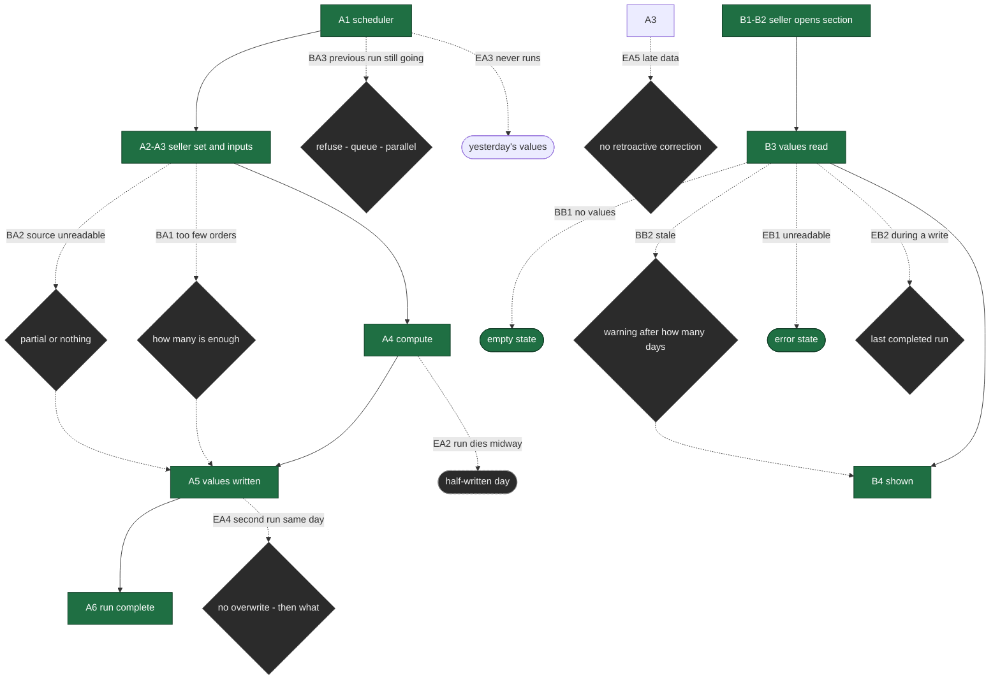

# flow-map — the first slice

This slice carries **two flows**, written separately because they have different triggers, different actors and different endings. Merging them into one table would hide where all the failures live: in A.

---

# A — The nightly calculation

**Starts:** the scheduler fires. True until then: yesterday's values are written.
**Ends (3):** values written · partially written · not written at all.
**Actors:** scheduler · the calculation job · the order, delivery, cancellation and review sources.

| # | Actor | What happens | System |
|---|---|---|---|
| A1 | Scheduler | Starts the run | |
| A2 | Calculation job | Determines the set of sellers to compute for | **reads** |
| A3 | Calculation job | Reads the inputs of the three components for each seller | **reads** |
| A4 | Calculation job | Computes the component values | |
| A5 | Calculation job | Writes the values with the date range they came from | **acts**, **emits** |
| A6 | Calculation job | Marks the run complete | **acts**, **emits** |

## Branches

**BA1 — the seller has too few orders in the period** *(from A3)*
1. The component is marked "no data"
→ **Rejoins at A5.** `[DECISION NEEDED]` how many orders is "enough" — owner Deniz (`request-shaper` B3). Undecided, zero orders and three orders are treated identically, and `design-brief`'s third example record (the zero that looks flawless) becomes real.

**BA2 — a component's source cannot be read** *(from A3)*
1. `[DECISION NEEDED]` owner Marketplace Core + Deniz: is **nothing** written for that seller, or are two components written and the third marked missing?
→ **Rejoins at A5.** The two answers are two different products: in the first the seller sees yesterday's values, in the second they see half of today's.

**BA3 — a run is triggered before the previous one finishes** *(from A1)*
1. `[DECISION NEEDED]` owner Marketplace Core: is the second run refused, queued, or run in parallel?
→ This branch cannot be closed without that decision. **Dangling.**

## Error paths

**EA1 — a source is slow and times out** *(A3)*
- **The person is left holding:** new values for some sellers, yesterday's for others
- **The way out:** rerun or wait
→ **Depends on the same decision as BA2.**

**EA2 — the run dies midway** *(between A4 and A5)*
- **Left holding:** **a half-written day.** The sellers processed first have new values, the rest have yesterday's. Nothing errors anywhere
- **The way out:** `[DECISION NEEDED]` — is a run all-or-nothing, or may it progress seller by seller? Owner Marketplace Core
→ **Never reaches A6.** This is the flow's quietest failure: nobody notices and the panel does not show it.

**EA3 — the run does not happen at all** *(A1)*
- **Left holding:** yesterday's values, with no indication
- **The way out:** the panel's last-calculated time **shows** it (`design-brief` section 6) — that is the only visibility
→ **Terminates.**

**EA4 — a second run on the same day** *(A5)*
- **Left holding:** two rows for the same seller-day, or an overwrite?
- **The way out:** `07-slice.md` says "no daily value is ever overwritten". **So what does the second run do?** There is an unsettled tension between the slice's rule and rerunning
→ `[DECISION NEEDED]` owner Marketplace Core. **Dangling.**

**EA5 — late-arriving data makes yesterday's value wrong** *(A3)*
- A review or cancellation that lands after the day it belongs to makes yesterday's component value wrong
- **Left holding:** a stored historical value that is wrong and not known to be
- **The way out:** **none.** The slice says values are never overwritten; no correction path is defined
→ `[DECISION NEEDED]` owner Deniz + Marketplace Core. **This is the data-side twin of the appeal (B8): with no retroactive correction, a seller who wins an appeal still has the wrong value.**

---

# B — The seller reads

**Starts:** the seller is signed in to the panel.
**Ends (3):** saw the values · saw the empty state · saw an error.
**Actors:** seller · panel.

| # | Actor | What happens | System |
|---|---|---|---|
| B1 | Seller | Opens the panel | |
| B2 | Seller | Opens the performance section | |
| B3 | Panel | Reads the seller's latest component values | **reads** |
| B4 | Panel | Shows the three components, the reference, the date range and the last calculation time | **emits** |
| B5 | Seller | Follows "how is this calculated" | |
| B6 | Panel | Shows the explanation | |

## Branches

**BB1 — the seller has no values at all** *(from B3)*
1. The empty state is shown
→ **Terminates.** Two different causes land in the same place: having no orders, and the run never having reached this seller. `design-brief` wants them distinguished; the data that would distinguish them is not written at A5.

**BB2 — the values are stale** *(from B3)*
1. The last calculation time is shown
2. `[DECISION NEEDED]` after how many days this becomes a warning — owner Deniz
→ **Rejoins at B4.**

## Error paths

**EB1 — the values cannot be read** *(B3)*
- **Left holding:** the performance section, while the rest of the panel works
- **The way out:** retry; the section shows its own error and does not hold up the panel (`design-brief` section 7)
→ **Terminates.**

**EB2 — the seller looks exactly while the run is writing** *(B3, concurrent with A5)*
- **Left holding:** possibly one new component and two from yesterday
- **The way out:** none — the seller cannot see this
→ `[DECISION NEEDED]` owner Marketplace Core: does a read see the last completed run, or the one being written? **Dangling.**

---

## What the seller must be able to tell apart

A product decision with no other owner.

| Must be distinguishable | Why |
|---|---|
| "You do not have enough orders in this period" (BA1) · "the value could not be calculated" (BA2) · "the values are stale" (EA3) | The seller does something different in each: wait / tell us / today's work has not landed yet. Showing all three as "no data" teaches the wrong behaviour three times |
| **Need not be** | |
| EA1 and EA2 | For the seller both are "some values are old". The distinction belongs in the log, not on screen |
| EB1 and a general panel error | Both are "we cannot show this right now" |

---

## Coverage

**12 happy-path steps (6 in A, 6 in B) · 5 branches · 7 error paths · 6 endings · 3 dangling branches (BA3, EA4, EB2).**

System touchpoints, by step number:

```
reads   A2, A3, B3            = 3
acts    A5, A6                = 2
emits   A5, A6, B4            = 3
                        total   8 marks, 6 marked steps (A2 A3 A5 A6 B3 B4)
```

Six of the twelve steps carry no mark: A1, A4, B1, B2, B5, B6. A4 being unmarked is worth noting — the computation itself reads nothing and writes nothing, its input arrives at A3 and its output is written at A5. That is correct, and A4 standing as a step of its own is what makes EA2 (dying between A4 and A5) visible.

**Seven error paths against twelve happy steps**, all of them concentrated in A. B has two, A has five. That is the shape of batch work: a plain user side, quiet failures behind it.

---

## Diagram

Node marking shows **decision status**; no screen has been drawn.



**The diagram was checked against the text:** all 5 branches and all 7 error paths appear. Of the decision nodes, Q1, Q2 and Q6 have two labelled exits; **Q3, Q4, Q5 and Q7 have one, because all four are unclosed** — they stand that way in the text too, and the drawing is not hiding it. EA5 hangs off A3 rather than A5: late data surfaces at the moment of reading, not the moment of writing.

---

## Still open

| Question | Who settles it |
|---|---|
| Is a run all-or-nothing, or may it progress seller by seller (EA2) | Marketplace Core — **the quietest failure here** |
| The tension between the no-overwrite rule and rerunning (EA4) | Marketplace Core |
| A retroactive correction path (EA5) — the data side of the appeal | Deniz + Marketplace Core |
| Does a read see the last completed run (EB2) | Marketplace Core |
| The "enough orders" threshold (BA1) | Deniz |
| Partial write or nothing (BA2) | Marketplace Core + Deniz |
| The staleness warning threshold (BB2) | Deniz |

**Next:** `flow-grill`, then `data-model` — and `data-model` before `api-needs`, because EA4 and EA5 are directly questions about what is stored and whether it can be overwritten, and neither is a contract question.
