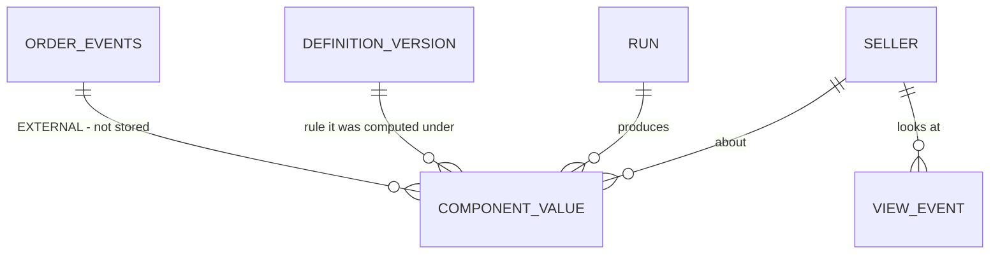

# data-model — what the system has to remember

**Derived from:** the marked steps of `09-flow-map.md`. No physical schema.

---

## Entities

### 1. Component value — *(seller × day × component type)*

The slice's central entity. A5 writes it, B3 reads it.

| | |
|---|---|
| **When are two records the same thing** | Same seller, same day, same component type. **And here the slice's own rule collides with a branch of the flow:** `07-slice.md` says "no daily value is ever overwritten", and `flow-map` EA4 leaves open what a second run that day does. `[DECISION NEEDED]` owner Marketplace Core: does a second run write a **new version** for the same triple (which then needs a "which one is current" field), or is it refused? There is no third option, and the code will pick one on day one |
| **Who does it belong to, and what happens when they leave** | The seller. If a seller leaves the platform, are the values deleted, anonymised, kept — `[DECISION NEEDED]` owner Legal, who also supplies the retention period. The appeal window and a deletion obligation can collide in the same row; no number is invented here |
| **What creates it, changes it, ends it** | Creates: A5. **Nothing changes it** — the slice's rule. Ends: retention only |
| **When something it copied changes, does this change too** | The seller is a **reference**. The component definition is a **reference to a version**, and because versions are immutable, history is not rewritten. The computed number itself is a **copy** — it is the result of a computation |
| **What must be true for it to exist** | A component value cannot exist without its seller, its day, its component type, **which definition version** produced it, and the date range it came from. **It can exist without a value** — and that is by design: "insufficient data" is not an absence, it is a stored state. `design-brief` requires three states to be distinguishable; this is the data side of that distinction |

**And one field has to be added, because the slice's own decision demands it.** `07-slice.md` decision 5: the answer to *"why was my value X on 3 November"* must be producible from the stored rows. `flow-grill` recorded as a High finding that the flow drops this: A5 writes only the value and the date range. A value is a rate; without its **numerator and denominator** the answer becomes "because the range was this", which is not an answer. **The numerator and denominator are stored** — not a storage preference, but the only form the slice's promise can take.

### 2. Calculation run

**The flow never names this entity, and A6 changes it.** `flow-grill`'s EA2 Critical — a half-written day that nothing marks — is precisely the absence of this entity.

| | |
|---|---|
| **When are two records the same** | `[DECISION NEEDED]` owner Marketplace Core: one run per day, or one per trigger? If per trigger, "the current run for that day" becomes a concept, and EA4 and BA3 both resolve from it |
| **What creates it, changes it, ends it** | Creates: A1. Changes: A6. **And it has to have a state** — started / complete / partial / failed. The flow has no such field, which is why a half-finished day in EA2 stays silent |
| **Log or record** | Record. It changes (start → end), so it is not a log |
| **What must be true for it to exist** | A start time and a target day. The end time and state arrive later |

### 3. Component definition version

What "on-time delivery" counts, which cancellations are seller-caused. A sentence today, possibly a different sentence tomorrow — and when that happens, **yesterday's values were computed under yesterday's sentence.**

- **Immutable.** A correction is a new version. Without that rule, one correction silently reinterprets all of history and no row shows it.
- **No step creates it.** Who writes the definition, who approves it, how it is published appears in no flow. `[DECISION NEEDED]` owner Deniz + Marketplace Core. An entity with no creating step is either an incomplete flow or an undeclared dependency; here it is the first.
- It is also what an appeal (B8) rests on: when a seller disputes a value, what is being disputed is the definition in force that day.

### 4. Seller · 5. Order and delivery events

Neither is created by this flow; both come from outside. **Two undeclared dependencies.** The component value holds a reference to the seller. Order events are stored nowhere, only read at A3 — and `flow-map` EA5 (late data) is the consequence: if the source changes afterwards, a stored value derived from it no longer agrees with its source, and nothing shows that.

### 6. View event

B4 is marked `emits`. **What it emits appears in no document** (`flow-grill`, Medium). It carries references: seller and day. It carries no copies.

---

## Relationships that carry a rule

- **A component value belongs to exactly one run.** *Forbids:* a value written without a run — so the rows produced by the half-finished run in EA2 can be found by looking at the run's state. Without this relationship a half day cannot be rolled back.
- **A seller has at most one current value per component type per day.** *Forbids:* two live rows for the same triple. The `[DECISION NEEDED]` above decides how that is enforced, not whether the rule holds.
- **A published definition version cannot be edited.** *Forbids:* correcting a definition in place — silently reinterpreting the past.
- **A component value cannot be transferred from one seller to another.** If a seller account changes hands, `[DECISION NEEDED]` owner Legal: does past performance follow the account?

---

## Stored or computed

| Thing | Decision | Why |
|---|---|---|
| Component value | **Stored** | It was shown to the seller and will be shown again |
| Its numerator and denominator | **Stored** | The only form the slice's decision 5 can take. It cannot be produced later: the source data changes (EA5) |
| Which definition version produced it | **Stored (reference)** | If the definition changes, the meaning of the historical value survives |
| The date range | **Stored** | The window length may change; when it does, the old row must keep saying what it was |
| **The blended score** | **Computed, and never shown in this slice** | Because the daily components are stored, it can be produced later at any weighting for any date. **This is the only thing that makes `07-slice.md`'s promise — "blending comes back cheaply" — true.** Had components not been stored daily, that promise would have been false |
| Last calculation time | **Read from the run** | Copying it onto every value keeps the same fact in two places at different ages |

---

## Checked against the flow

| Sweep | Result |
|---|---|
| Every `reads` step names what it reads | **3/3 matched.** A2 → Seller · A3 → Order events (external) · B3 → Component value + Run |
| Every `acts` step names what it writes | **2/2 matched** — but the entity A6 writes (the Run) **is named nowhere in the flow.** The flow changes something it never names |
| Every `emits` step says copy or reference | **3/3 decided**, all references. Number whose contents are defined: 0 |
| Every entity names the step that creates it | **2 of 6.** Seller and Order events come from outside — two undeclared dependencies. **No step creates the component definition version**, and that is an incomplete flow |

---

## Diagram

**Checked:** all 6 entities in the table appear; nothing in the diagram is absent from the table; cardinalities match.

**What the diagram cannot show:** the no-overwrite rule, the immutability of definition versions, the existence of a run state, the numerator/denominator decision, and all four prohibitions. Anyone reading only the picture is reading the half of the model with no decisions in it.

---

## Decisions still needed

| Decision | Who | What it blocks |
|---|---|---|
| Second run same day: new version or refusal | Marketplace Core | The identity rule; `flow-map` EA4 |
| One run per day or per trigger | Marketplace Core | Resolves both `flow-map` BA3 and EA4 |
| Retention, and what happens when a seller leaves | Legal | A deletion obligation colliding with the appeal window |
| Who publishes a definition version | Deniz + Marketplace Core | A step that exists in no flow |
| Past performance on an account transfer | Legal | The relationship rule |
| The contents of the view event | Deniz | `api-needs` will derive it from one mark |

**Next:** `api-needs`. The nouns are defined, so the contract will not be written over guesses — but every line written while those six decisions are open assumes one of them.
